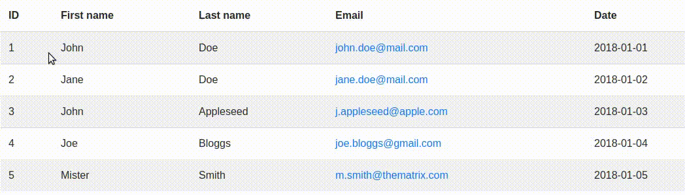

# TableSelection
Adds **rectangular selection** to **HTML tables** to allow copy of specific columns and rows without copying contents of other cells in range.



<br/>

- Supports horizontal, vertical and rectangular selections.
- Includes **clipboard** support with table formatting for **Excel** or other **spreadsheet** software!
- It even works on **mobile**!
- Tested and working in Chrome, Firefox, Edge, Mobile Chrome and Samsung Browser
- Lightweight (5,4 kB)

<br/>

## Table of contents
- [Installation](#installation)
    - [Using precompiled js](#installation-precompiled)
    - [Using a module loader](#installation-module-loader)
- [Upgrading from 0.9.x](#upgrading)
- [Usage](#usage)
- [API](#api)
- [Demo](#demo)
- [License (it's free!)](#license)

<br/>

<a name="installation"></a>
## Installation
- Run `npm i @pxlwidgets/table-selection` or download the sources.


<a name="installation-precompiled"></a>
##### Using the precompiled js and css files

- Include `dist/js/table-selection.js` or `dist/js/table-selection.min.js` in your project or import using a module loader (more info below).
- Include `dist/css/table-selection.css` or `dist/css/table-selection.min.css` in your project (or use the provided LESS or SCSS file).


<a name="installation-module-loader"></a>
##### Using a module loader

The package includes files for integration in **Typescript** and **ES6** projects:

```typescript
import { TableSelection } from '@pxlwidgets/table-selection';
```
<br/>
<br/>

<a name="upgrading"></a>
## Upgrading from v0.9.x
v1.x no longer uses a stylesheet file, so you should remove any of these CSS/SCSS/LESS imports:
- CSS: `dist/css/table-selection.css`
- SCSS: `@import '~/@pxlwidgets/table-selection'`
- LESS: `@include 'node_modules/@pxlwidgets/table-selection/dist/less/table-selection.less'`


<a name="usage"></a>
## Usage
- Add `.table-selection` class to the table(s) you want to apply the selection functionality on.
- Initialize the script using `new TableSelection()`.

> **Note**<br>
> You can use a different DOM selector by setting the `selector` configuration option when creating the Javascript instance.

<br/>

<a name="api"></a>
## Javascript API
The constructor takes one, optional argument.

```typescript
constructor(config: TableSelectionConfig = {})
```

The `config` parameter (interface `TableSelectionConfig`) has the following properties: 

| Property            | Type     | Required | Default              | Description                                                                                                                                                                                                                       |
|---------------------|----------|----------|----------------------|-----------------------------------------------------------------------------------------------------------------------------------------------------------------------------------------------------------------------------------|
| `selector`          | `string` | No       | `'.table-selection'` | Sets the DOM selector to apply the functionality to. This should point to one or more table elements on your page. E.g. `table` or `.table`.                                                                                      |
| `selectionCssMode`  | `string` | No       | `'.style'`           | One of `'style'` or `'cssClass'`. Sets which method to use to highlight selected cells. `'style'` uses style attributes with CSS variables. `'cssClass'` adds the CSS class specified in the `selectionCssClass` config property. |
| `selectionCssClass` | `string` | No       | `'selected'`         | Sets the CSS class to apply to 'selected' table cells. E.g. `active`, `selected` or `highlighted`. This only applies if the `selectionCssMode` is set to `'cssClass'` and requires you to add styles for the selector yourself.   |


Example usage :
```typescript
new TableSelection({
  selector: '#my-table',
  selectionCssMode: 'cssClass',
  selectionCssClass: 'my-highlighted-cell-class',
});
```
<br/>

For example:<br/>

```typescript
new TableSelection();
```
<br/>

```typescript
new TableSelection({ selector: 'table' });
```
<br/>

<br/>

<a name="demo"></a>
## Demo
[View live example on Codepen](https://codepen.io/opznhaarlems/full/YzrxmOr)

<br/>

<a name="license"></a>
## License
MIT License

Copyright (c) 2019 Wouter Smit
Copyright (c) 2019 PXL.Widgets B.V.

Permission is hereby granted, free of charge, to any person obtaining a copy
of this software and associated documentation files (the "Software"), to deal
in the Software without restriction, including without limitation the rights
to use, copy, modify, merge, publish, distribute, sublicense, and/or sell
copies of the Software, and to permit persons to whom the Software is
furnished to do so, subject to the following conditions:

The above copyright notice and this permission notice shall be included in all
copies or substantial portions of the Software.

THE SOFTWARE IS PROVIDED "AS IS", WITHOUT WARRANTY OF ANY KIND, EXPRESS OR
IMPLIED, INCLUDING BUT NOT LIMITED TO THE WARRANTIES OF MERCHANTABILITY,
FITNESS FOR A PARTICULAR PURPOSE AND NONINFRINGEMENT. IN NO EVENT SHALL THE
AUTHORS OR COPYRIGHT HOLDERS BE LIABLE FOR ANY CLAIM, DAMAGES OR OTHER
LIABILITY, WHETHER IN AN ACTION OF CONTRACT, TORT OR OTHERWISE, ARISING FROM,
OUT OF OR IN CONNECTION WITH THE SOFTWARE OR THE USE OR OTHER DEALINGS IN THE
SOFTWARE.
